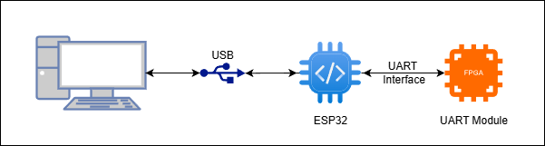
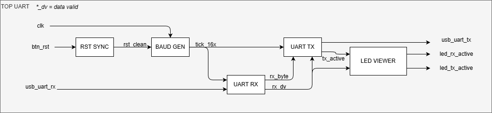
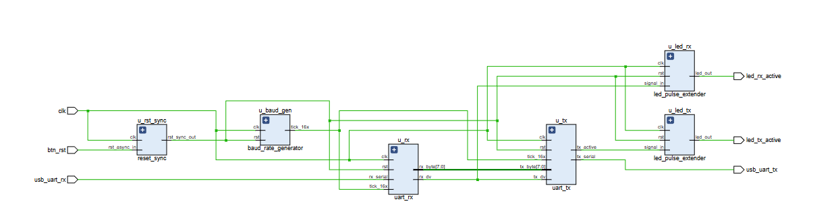
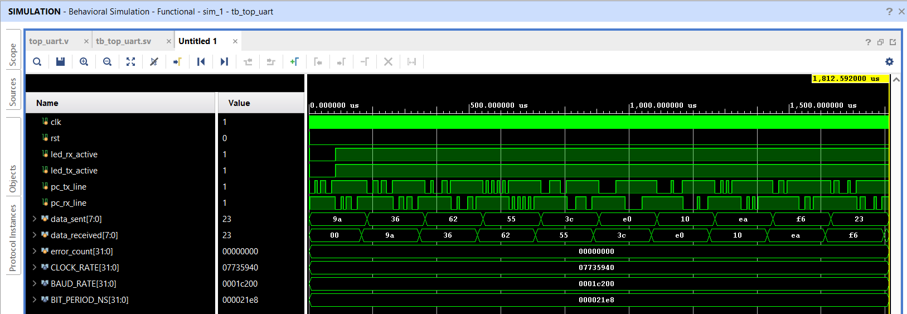
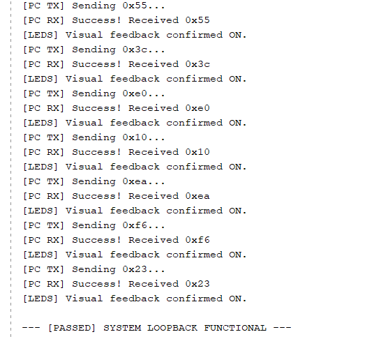
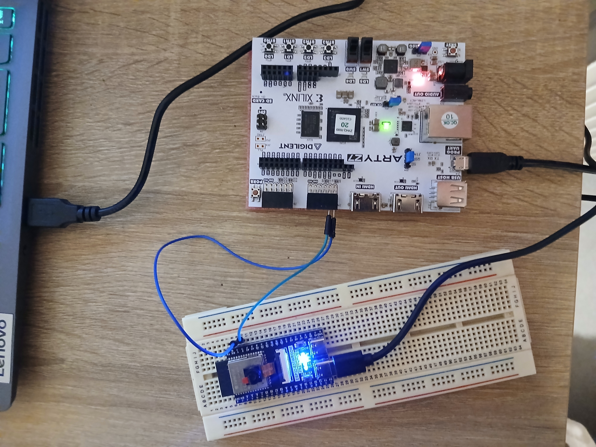
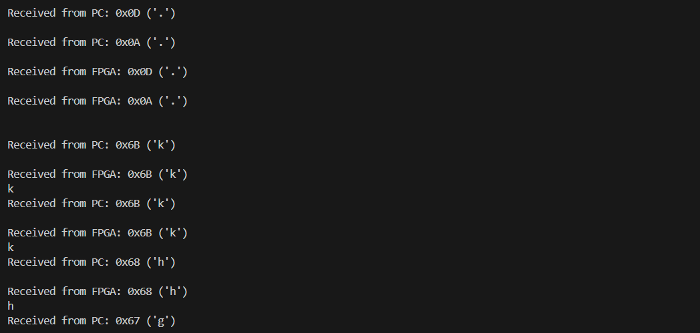

# FPGA UART Controller & Hardware-in-the-Loop Verification



## Project Overview
This project implements a robust Universal Asynchronous Receiver-Transmitter (UART) controller on the **Arty Z7-20** FPGA using pure Programmable Logic (PL). The design features a modular architecture with **16x oversampling** for noise immunity and is verified using a modern **SystemVerilog testbench** featuring concurrent assertions and randomized traffic generation.

To validate the design physically, a custom **Hardware-in-the-Loop (HIL)** test environment was developed using an ESP32 microcontroller acting as a transparent USB-to-UART bridge.




## Project Structure
The repository is organized to separate hardware description (RTL) from firmware logic:

```text
fpga_uart_controller/
├── src/
│   ├── rtl/            # Synthesizable SystemVerilog/Verilog (UART Core, Pulse Extenders)
│   ├── tb/             # SystemVerilog Testbenches (Self-checking, Randomized)
│   └── constrs/        # Xilinx Design Constraints (.xdc)
├── esp32_bridge/       # PlatformIO Project (C++ Firmware for the Bridge)
└── docs/               # Waveforms and Diagrams
```


## Architectural Decisions
### 1. The "External Bridge" Strategy (Zynq Bypass)
The **Arty Z7-20** is based on the Xilinx Zynq-7000 SoC architecture. Its native USB-UART port is hardwired to the Processing System (ARM Core). To demonstrate a **pure logic implementation** without relying on the OS or software drivers, we mapped the UART signals to the **Pmod JA** header. An external ESP32 acts as the physical bridge to the PC.

### 2. Clock Domain Safety (CDC)
- **Reset Synchronizer**: The external button (`BTN0`) is asynchronous. A "Reset Bridge" (double flip-flop) module is used to synchronize the reset signal into the 125 MHz clock domain, preventing metastability.
- **Baud Generation**: Uses a synchronized enable pulse (`tick_16x`) rather than a derived clock, ensuring the integrity of the FPGA clock tree.

### 3. Usability & Visual Feedback
UART signals are too fast for the human eye (8.6 µs per bit). To make the system observable during testing, a Pulse Extender module was implemented. It detects the fast 1-cycle `rx_dv` and `tx_active` signals and stretches them into 50ms visible pulses to drive the on-board LEDs.


## Hardware Specifications
* **FPGA Board:** Digilent Arty Z7-20 (Zynq-7000 AP SoC)
* **Bridge Controller:** ESP32-S3 (Freenove CAM Board)
* **Communication Protocol:** UART (8 Data bits, No Parity, 1 Stop bit - 8N1)
* **Baud Rate:** 115,200 bps
* **System Clock:** 125 MHz


## RTL Design Details
The design is fully synchronous and modular:

1.  **Baud Rate Generator:**
    * Parametric clock divider.
    * Generates a `tick_16x` enable pulse (16 times the target baud rate) to synchronize RX and TX modules without using derived clocks (preserves clock tree integrity).
2.  **UART RX (Receiver):**
    * Finite State Machine (FSM): `IDLE` -> `START` -> `DATA` -> `STOP`.
    * **Noise Rejection:** Uses center-sampling logic. Data is captured at the 8th tick of the oversampling clock (middle of the bit period) to avoid metastability and signal glitches.
3.  **UART TX (Transmitter):**
    * Drives the serial line synchronously based on the `tick_16x` reference.
4.  **Reset Synchronizer:**
    * Implements a "Reset Bridge" (double flip-flop synchronizer) to safely bring the asynchronous external button signal into the 125 MHz clock domain.
5.  **Led Pulse Extender:**
    * Visual feedback logic for LEDs




## Verification Strategy
The verification environment was upgraded from standard Verilog to **SystemVerilog** to utilize advanced verification constructs.

### 1. Unit Testing
* **Baud Generator:** Verified timing accuracy using `realtime` checks and tolerance assertions.
* **Protocol Logic:** Verified frame integrity (Start/Stop bits) and data reconstruction.

### 2. Integration Testing (Loopback)
A concurrent testbench (`fork/join`) was used to simulate the full echo path:
* **Randomization:** Used `std::randomize()` to inject random ASCII patterns instead of fixed test vectors.
* **Self-Checking:** A dynamic scoreboard (Queue) compares sent vs. received data automatically.
* **Robustness:** Implemented timeout checks to detect system hangs and injected glitches to test noise rejection.





## Hardware Setup & Pinout



**WARNING:** Correct wiring is critical. Transmit (TX) must always connect to Receive (RX).

### Wiring Interface
The connection is made via the **Pmod JA** header (Top Row).

| Arty Z7 (Pmod JA)     | FPGA Pin  | Signal Direction  | Connection to ESP32               |
| :---                  | :---      | :---              | :---                              |
| **Pin 1** (Top Left)  | Y18       | **RX** (Input)    | Connect to **ESP32 TX** (Pin 1)   |
| **Pin 2** (Top Right) | Y19       | **TX** (Output)   | Connect to **ESP32 RX** (Pin 2)   |
| **GND**               | -         | Common Ground     | -                                 |


### User Controls & Feedback
| Component     | Label     | FPGA Pin  | Function                              |
| :---          | :---      | :---      | :---                                  |
| **Button**    | **BTN0**  | D19       | System Reset (Active High)            |
| **LED**       | **LED0**  | R14       | **RX Activity** (Blinks on receive)   |
| **LED**       | **LED1**  | P14       | **TX Activity** (Blinks on echo)      |

## How to Run

### 1. FPGA Implementation
1.  Open the project in **Vivado**.
2.  Import sources from `src/rtl` and constraints from `src/constrs`.
3.  Run **Generate Bitstream**.
4.  Open **Hardware Manager**, connect to the Arty Z7, and program the device.
5.  Press **BTN0** on the board once to ensure the FSM is reset.

### 2. Bridge Setup (PlatformIO)
1.  Open the `esp32_fpga_bridge.ino` folder in **VS Code** (ensure PlatformIO extension is installed).
2.  Connect the ESP32 to USB.
3.  Click the **PlatformIO Upload** arrow (->) to flash the firmware.
4.  Verify wiring: **Arty JA1 <-> ESP Pin 1** and **Arty JA2 <-> ESP Pin 2**.

### 3. Final Test
1.  Open the **PlatformIO Serial Monitor** (plug icon).
2.  Type any character.
3.  **Observation:**
    * The character echoes back in the terminal
    * LED0 and LED1 on the Arty Z7 blink synchronously




## Demo Video
*(Note: We should see the LEDs flashing each time a character is written to the serial monitor.)*

https://github.com/Adebayo17/fpga_uart_controller/tree/master/docs/demo/uart_loopback_demo.mp4